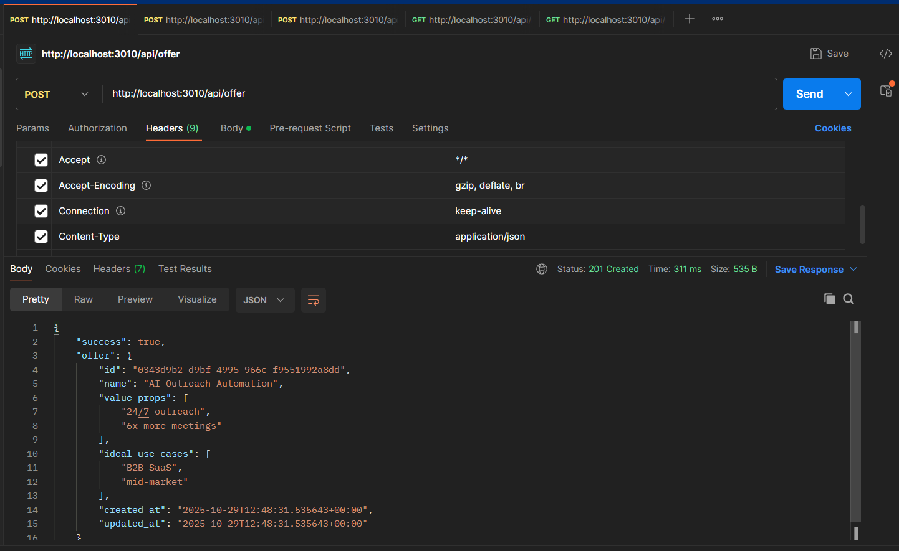
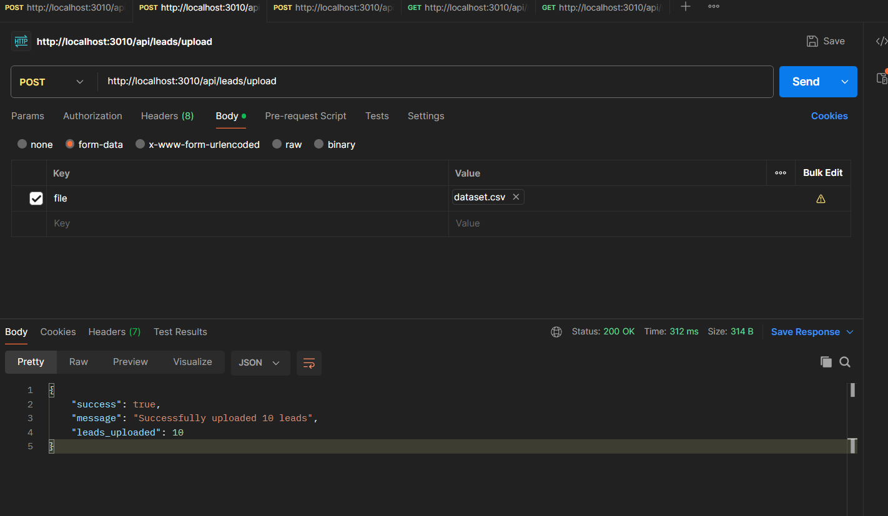
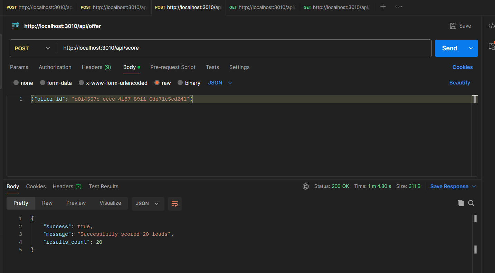
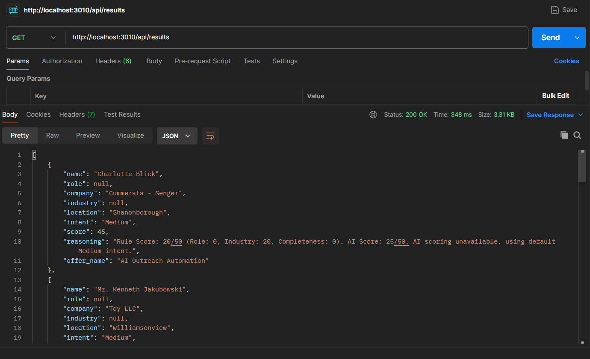
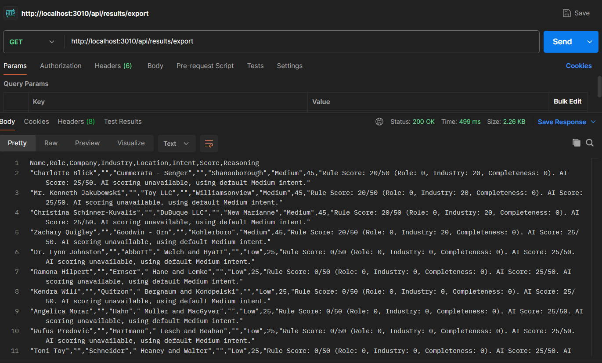

# Lead Qualification Backend API

A backend service that accepts product/offer information and CSV files of leads, then scores each lead's buying intent using rule-based logic combined with AI reasoning.

## Features

- **Product/Offer Management**: Create and manage product offerings
- **CSV Lead Upload**: Bulk upload leads from CSV files
- **Intelligent Scoring**: Hybrid scoring system combining rule-based logic (50 points) and AI analysis (50 points)
- **Intent Classification**: Automatic classification as High/Medium/Low intent
- **Results Export**: Export scoring results as CSV
- **RESTful API**: Clean, well-documented endpoints

## Tech Stack

- **Backend**: Node.js + Express
- **Database**: Supabase (PostgreSQL with Row Level Security)
- **AI Provider**: OpenAI GPT-3.5 Turbo
- **File Processing**: Multer + csv-parser

## Setup Instructions

### Prerequisites

- Node.js 14+ installed
- OpenAI API key ([Get one here](https://platform.openai.com/api-keys))
- Supabase project (already configured)

### Installation

1. **Clone the repository**
   ```bash
   git clone <your-repo-url>
   cd <project-directory>
   ```

2. **Install dependencies**
   ```bash
   npm install
   ```

3. **Configure environment variables**

   Update the `.env` file with your OpenAI API key:
   ```
   VITE_SUPABASE_URL=https://cacbjjgsvjbsbzbhpxop.supabase.co
   VITE_SUPABASE_ANON_KEY=eyJhbGciOiJIUzI1NiIsInR5cCI6IkpXVCJ9...
   OPENAI_API_KEY=sk-your-actual-openai-key-here
   ```

4. **Start the server**
   ```bash
   npm start
   ```

   The API will be available at `http://localhost:3010`

## API Documentation

### Base URL
```
http://localhost:3010/api
```

### Endpoints

#### 1. Create Product/Offer
**POST** `/offer`

Create a new product or offer for lead qualification.

**Request Body:**
```json
{
  "name": "AI Outreach Automation",
  "value_props": ["24/7 outreach", "6x more meetings", "AI-powered personalization"],
  "ideal_use_cases": ["B2B SaaS", "mid-market", "sales teams"]
}
```

**Example cURL:**
```bash
curl -X POST http://localhost:3010/api/offer \
  -H "Content-Type: application/json" \
  -d '{
    "name": "AI Outreach Automation",
    "value_props": ["24/7 outreach", "6x more meetings"],
    "ideal_use_cases": ["B2B SaaS", "mid-market"]
  }'
```

**Response:**
```json
{
  "success": true,
  "offer": {
    "id": "uuid-here",
    "name": "AI Outreach Automation",
    "value_props": ["24/7 outreach", "6x more meetings"],
    "ideal_use_cases": ["B2B SaaS", "mid-market"],
    "created_at": "2025-01-15T10:00:00Z"
  }
}
```

---

#### 2. Upload Leads CSV
**POST** `/leads/upload`

Upload a CSV file containing lead information.

**CSV Format:**
```csv
name,role,company,industry,location,linkedin_bio
Ava Patel,Head of Growth,FlowMetrics,B2B SaaS,San Francisco,Growth leader with 8+ years scaling SaaS companies
John Smith,Marketing Manager,TechCorp,Technology,New York,Experienced marketing professional
```

**Example cURL:**
```bash
curl -X POST http://localhost:3010/api/leads/upload \
  -F "file=@sample_leads.csv"
```

**Response:**
```json
{
  "success": true,
  "message": "Successfully uploaded 8 leads",
  "leads_uploaded": 8
}
```

---

#### 3. Score Leads
**POST** `/score`

Run the scoring pipeline on all uploaded leads for a specific offer.

**Request Body:**
```json
{
  "offer_id": "uuid-of-offer"
}
```

**Example cURL:**
```bash
curl -X POST http://localhost:3010/api/score \
  -H "Content-Type: application/json" \
  -d '{"offer_id": "your-offer-uuid"}'
```

**Response:**
```json
{
  "success": true,
  "message": "Successfully scored 8 leads",
  "results_count": 8
}
```

---

#### 4. Get Results
**GET** `/results`

Retrieve scoring results with optional filters.

**Query Parameters:**
- `offer_id` (optional): Filter by specific offer
- `intent` (optional): Filter by intent level (High/Medium/Low)
- `min_score` (optional): Filter by minimum score

**Example cURL:**
```bash
curl http://localhost:3010/api/results

# With filters
curl "http://localhost:3010/api/results?intent=High&min_score=70"
```

**Response:**
```json
[
  {
    "name": "Ava Patel",
    "role": "Head of Growth",
    "company": "FlowMetrics",
    "industry": "B2B SaaS",
    "location": "San Francisco",
    "intent": "High",
    "score": 85,
    "reasoning": "Rule Score: 40/50 (Role: 20, Industry: 20, Completeness: 0). AI Score: 45/50. Strong fit as Head of Growth in B2B SaaS matches ideal customer profile perfectly."
  }
]
```

---

#### 5. Export Results as CSV (Bonus)
**GET** `/results/export`

Export scoring results as a downloadable CSV file.

**Query Parameters:** Same as `/results`

**Example cURL:**
```bash
curl "http://localhost:3010/api/results/export?intent=High" -o results.csv
```

---

#### 6. Get All Offers
**GET** `/offers`

Retrieve all created offers.

**Example cURL:**
```bash
curl http://localhost:3010/api/offers
```

---

#### 7. Get All Leads
**GET** `/leads`

Retrieve all uploaded leads.

**Example cURL:**
```bash
curl http://localhost:3010/api/leads
```

---

#### 8. Health Check
**GET** `/health`

Check if the API is running.

**Example cURL:**
```bash
curl http://localhost:3010/health
```

## Scoring Logic

### Rule Layer (0-50 points)

1. **Role Relevance (0-20 points)**
   - Decision maker (CEO, CTO, VP, Director, Head of, etc.): **20 points**
   - Influencer (Manager, Lead, Senior, etc.): **10 points**
   - Other roles: **0 points**

2. **Industry Match (0-20 points)**
   - Exact ICP match: **20 points**
   - Adjacent industry: **10 points**
   - No match: **0 points**

3. **Data Completeness (0-10 points)**
   - All fields present (name, role, company, industry, location, bio): **10 points**
   - Missing fields: **0 points**

### AI Layer (0-50 points)

The AI analyzes the prospect against the offer using:
- LinkedIn bio content
- Role and industry context
- Product value propositions
- Ideal use cases

**AI Intent Mapping:**
- High intent: **50 points**
- Medium intent: **30 points**
- Low intent: **10 points**

### Final Classification

**Total Score = Rule Score + AI Score**

- **High**: 70-100 points
- **Medium**: 40-69 points
- **Low**: 0-39 points

## AI Prompting Strategy

The system sends contextualized prompts to OpenAI that include:

1. **Product Context**: Name, value propositions, ideal use cases
2. **Prospect Context**: Name, role, company, industry, location, LinkedIn bio
3. **Clear Instructions**: Classify intent and provide reasoning in 1-2 sentences
4. **Structured Output**: JSON format for consistent parsing

**Example Prompt:**
```
You are a B2B lead qualification expert. Analyze this prospect's fit for our product/offer.

Product/Offer: AI Outreach Automation
Value Propositions: 24/7 outreach, 6x more meetings
Ideal Use Cases: B2B SaaS, mid-market

Prospect:
- Name: Ava Patel
- Role: Head of Growth
- Company: FlowMetrics
- Industry: B2B SaaS
- Location: San Francisco
- LinkedIn Bio: Growth leader with 8+ years scaling SaaS companies...

Based on the prospect's role, industry, and background, classify their buying intent as High, Medium, or Low. Provide a 1-2 sentence explanation.

Respond in this exact JSON format:
{
  "intent": "High|Medium|Low",
  "reasoning": "Your 1-2 sentence explanation"
}
```

## Testing the API

### Complete Workflow Example

1. **Create an offer:**
   ```bash
   curl -X POST http://localhost:3010/api/offer \
     -H "Content-Type: application/json" \
     -d '{
       "name": "AI Outreach Automation",
       "value_props": ["24/7 outreach", "6x more meetings"],
       "ideal_use_cases": ["B2B SaaS", "mid-market"]
     }'
   ```

   Copy the `id` from the response.

2. **Upload leads:**
   ```bash
   curl -X POST http://localhost:3010/api/leads/upload \
     -F "file=@sample_leads.csv"
   ```

3. **Run scoring:**
   ```bash
   curl -X POST http://localhost:3010/api/score \
     -H "Content-Type: application/json" \
     -d '{"offer_id": "paste-offer-id-here"}'
   ```

4. **View results:**
   ```bash
   curl http://localhost:3010/api/results
   ```

5. **Export to CSV:**
   ```bash
   curl "http://localhost:3010/api/results/export?intent=High" -o high_intent_leads.csv
   ```

## Database Schema

### Tables

- **offers**: Stores product/offer information
- **leads**: Stores prospect data from CSV uploads
- **scoring_results**: Stores calculated scores and intent classifications

### Security

- Row Level Security (RLS) enabled on all tables
- Public access policies configured for demo purposes
- In production, implement proper authentication and authorization

## Project Structure

```
.
├── config/
│   └── supabase.js          # Supabase client configuration
├── routes/
│   ├── offerRoutes.js       # Offer management endpoints
│   ├── leadRoutes.js        # Lead upload endpoints
│   └── scoringRoutes.js     # Scoring and results endpoints
├── services/
│   ├── scoringService.js    # Rule-based scoring logic
│   └── aiService.js         # OpenAI integration
├── uploads/                 # Temporary CSV uploads (auto-created)
├── index.js                 # Main application entry point
├── sample_leads.csv         # Sample CSV for testing
├── .env                     # Environment variables
└── README.md               # This file
```

## Error Handling

The API includes comprehensive error handling:

- **400 Bad Request**: Invalid input or missing required fields
- **404 Not Found**: Resource not found (e.g., invalid offer_id)
- **500 Internal Server Error**: Server or database errors

All errors return JSON with descriptive messages:
```json
{
  "error": "Error description",
  "details": "Additional context"
}
```

## Deployment

This application is ready to deploy to any Node.js hosting platform:

- **Render**: Connect GitHub repo, add environment variables
- **Railway**: One-click deploy from GitHub
- **Heroku**: `git push heroku main`
- **Vercel/Netlify**: Works with serverless functions

**Required Environment Variables:**
- `VITE_SUPABASE_URL`
- `VITE_SUPABASE_ANON_KEY`
- `OPENAI_API_KEY`

## Bonus Features Implemented

✅ **CSV Export**: Download results as CSV via `/api/results/export`
✅ **Query Filters**: Filter results by offer, intent, and minimum score
✅ **Sample Data**: Included `sample_leads.csv` for quick testing
✅ **Health Check**: `/health` endpoint for monitoring
✅ **Comprehensive Error Handling**: Detailed error messages throughout

## Future Enhancements

- Unit tests for rule layer scoring
- Docker containerization
- Batch processing for large CSV files
- Webhook notifications for scoring completion
- Admin dashboard for monitoring
- Rate limiting and caching
- Advanced filtering and search

Local Uses : 




